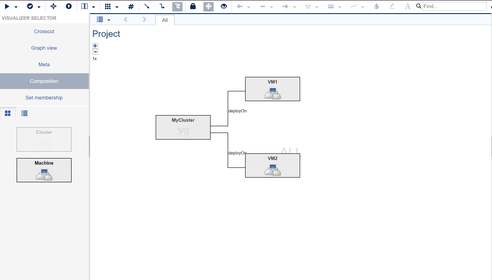
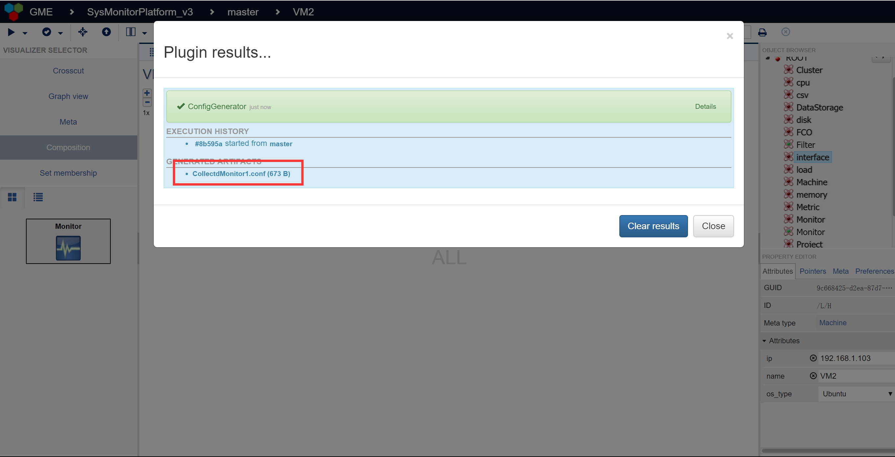
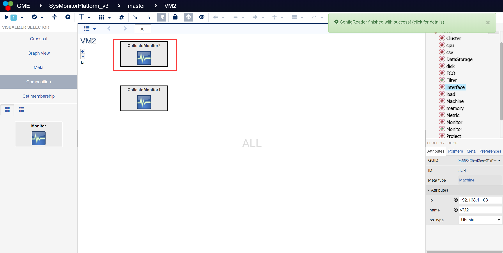

# mygme
## Installation
First, install the mygme following:
- [NodeJS](https://nodejs.org/en/) (v4.x.x recommended)
- [MongoDB](https://www.mongodb.com/)

Second, start mongodb locally by running the `mongod` executable in your mongodb installation (you may need to create a `data` directory or set `--dbpath`).

Then, run `webgme start` from the project root to start . Finally, navigate to `http://localhost:8888` to start using mygme!

## Meta-model design

## A simple demo model

## Plugin example
### check the configuaration correctness

### generate the configuration file from model

### read from a configuration file to generate corresponding model

