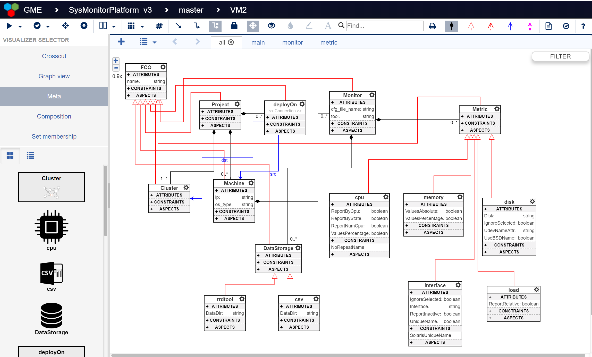

# mygme
## Installation
First, install the mygme following:
- [NodeJS](https://nodejs.org/en/) (v4.x.x recommended)
- [MongoDB](https://www.mongodb.com/)

Second, start mongodb locally by running the `mongod` executable in your mongodb installation (you may need to create a `data` directory or set `--dbpath`).

Then, run `webgme start` from the project root to start . Finally, navigate to `http://localhost:8888` to start using mygme!

## Meta-model design

## A simple model instance

## Plugin example
### 1 Check the configuaration correctness
Run the ModelChecker plugin inside a node of meta-type Monitor.

If your configuration is all correct, the plugin will show a successful running state, otherwise, you will get a runtime error as following, and the detail information will be given in the Messeage field.

### 2 Generate the configuration file from model
Run the ConfigGnerator plugin inside a node of meta-type Machine.

After running, you can download the generated configuration file from the artifacts field.

The generated configuration file is something like this.

### 3 Read from a configuration file to generate corresponding model
Run the ConfigReader plugin inside a node of meta-type Machine.

